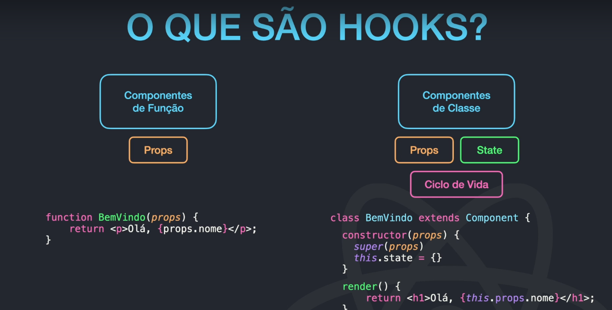
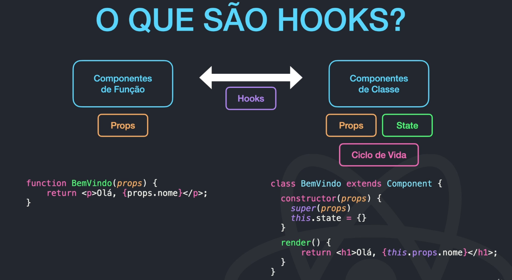

# Instalar um projeto já existente

Se já pegar um projeto já existente, depois de criar o diretorio, no teminal

```
npm install
```

Isso faz com que o node instale todas as dependências.

## Promise

São objetos usados para processamento assincrono. Representa um proxy para um valor não necessariamente conhecido.
Fetch retornam promisses.

# Hooks



## Recurso disponível a partir da versão 16.8 do react

    -São funções que permitem uso do state e e ciclo de vida do react sem escrever uma classe.
    - Sintaxe useNomeDoHook(). Exemplo: useState para gerenciar estado.
    - Hooks não funcionam dentro de classe
    - Hooks básicos: useState(), useEffect(), useContext
    - Hooks adicionais: useReducer(), useCallback(), useMemo(), useRef()


